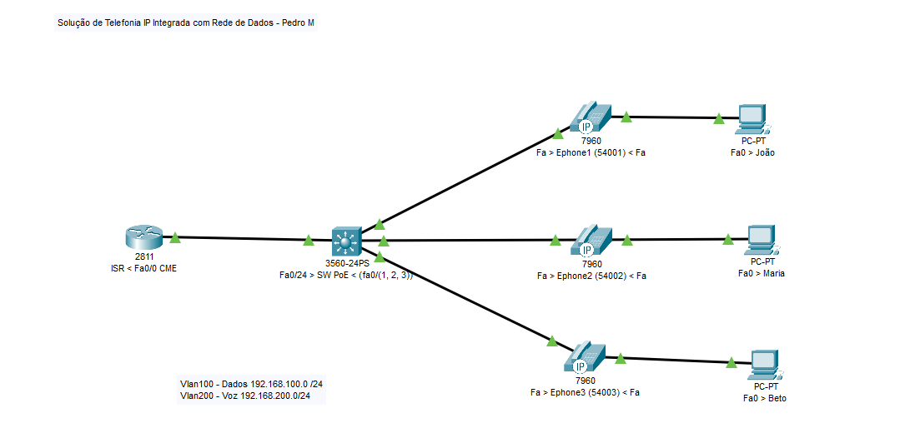

#  Configuração de Telefonia IP no Packet Tracer:

## Introdução:

Este tutorial o guiará na configuração de telefonia IP integrada à rede de dados usando o Cisco Packet Tracer. 
A solução utiliza o Call Manager Express (CME) da Cisco, transformando o roteador em um PABX.

## Observações Importantes:

Os computadores se conectam aos telefones IP da Cisco, que por sua vez se conectam ao switch.
O switch 3560 possui PoE (Power over Ethernet) ativado, alimentando os telefones via cabo de rede.
Desative o PoE no roteador se os telefones usarem fonte externa.

## Configuração:

Desativar Resolução de Nomes:
```
no ip domain lookup
Desativar PoE (opcional):
enable
conf t
interface range f 0/1 - 24
power inline never
end
```
Configurar VLANs no Switch:
```
enable
conf t
hostname SW-PoE
vlan 100
name VLAN-Dados
vlan 200
name VLAN-VoIP

interface f 0/24
switchport trunk encapsulation dot1q
switchport mode trunk

interface range f 0/1 - 3
switchport mode access
switchport access vlan 100
switchport voice vlan 200
end
```
Configurar Trunk no Roteador:
```
enable
conf t
hostname ISR
interface f 0/0
no shut
interface f 0/0.100
encapsulation dot1q 100
ip address 192.168.100.254 255.255.255.0
interface f 0/0.200
encapsulation dot1q 200
ip address 192.168.200.254 255.255.255.0
end
```
Configurar DHCP:

- Para Computadores:
```
enable
conf t
ip dhcp excluded-address 192.168.100.254
ip dhcp pool DHCP-Dados
network 192.168.100.0 255.255.255.0
default-router 192.168.100.254
end
```
- Para Telefones IP:
```
enable
conf t
ip dhcp excluded-address 192.168.200.254
ip dhcp pool DHCP-VoIP
network 192.168.200.0 255.255.255.0
default-router 192.168.200.254
option 150 ip 192.168.200.254
end
```
6. Configurar CME:

```
enable
conf t
telephony-service
max-dn 10
max-ephones 10
ip source-address 192.168.200.254 port 2000
auto-reg-ephone
end
```
7. Verificar Ephones:

```
show ephone
```
8. Configurar Ramais:

```
enable
conf t
ephone-dn 1
number 54001
ephone-dn 2
number 54002
ephone-dn 3
number 54003
end

ephone 1
button 1:1
ephone 2
button 1:2
ephone 3
button 1:3
end
```
## Teste e Adição de Ramal:

Abra a interface gráfica dos telefones e faça chamadas.
Se tudo funcionar, configure um ramal para o novo funcionário Frederico.
Recursos Adicionais:

## Consulte o roteiro original para detalhes específicos.
Pesquise sobre PoE, VLANs e CME para aprofundar seus conhecimentos.
Dicas:

## Siga as instruções passo a passo para evitar erros.
Verifique as configurações de IP e VLAN dos dispositivos.
Utilize o comando "show" para verificar o status da configuração.


# Scripts
## Roteador
```
no ip domain lookup

hostname ISR

interface f 0/0
no shut
interface f 0/0.100
encapsulation dot1q 100
ip address 192.168.100.254 255.255.255.0
interface f 0/0.200
encapsulation dot1q 200
ip address 192.168.200.254 255.255.255.0

ip dhcp excluded-address 192.168.100.254
ip dhcp pool DHCP-Dados
network 192.168.100.0 255.255.255.0
default-router 192.168.100.254

ip dhcp excluded-address 192.168.200.254
ip dhcp pool DHCP-VoIP
network 192.168.200.0 255.255.255.0
default-router 192.168.200.254
option 150 ip 192.168.200.254

telephony-service
max-dn 10
max-ephones 10
ip source-address 192.168.200.254 port 2000
auto-reg-ephone

ephone-dn 1
number 54001
ephone-dn 2
number 54002
ephone-dn 3
number 54003

ephone 1
button 1:1
ephone 2
button 1:2
ephone 3
button 1:3
```
## Switch:
```
enable
conf t
hostname SW-PoE

vlan 100
name VLAN-Dados
vlan 200
name VLAN-VoIP

interface f 0/24
switchport trunk encapsulation dot1q
switchport mode trunk

interface range f 0/1 - 3
switchport mode access
switchport access vlan 100
switchport voice vlan 200

interface range f 0/1 - 24
power inline never
end
```
